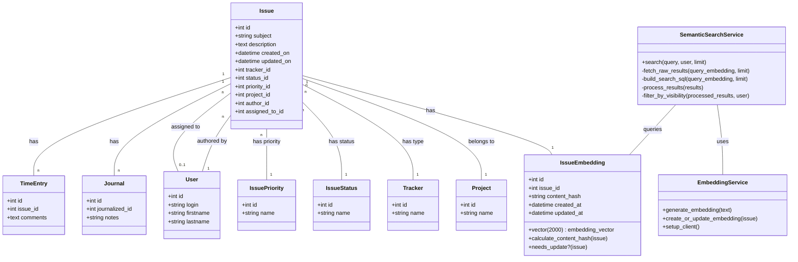

# IPA Präsentation

## Semantische Redmine Suche

Sami Hindi
09.05.2025 - 22.05.2025

---

# Inhalt

- Die Aufgabe: Bessere Redmine-Suche
- Lösung: Semantisches Such-Plugin
- Projektphasen (IPERKA)
- Live Demo
- Q&A

---

# Die Aufgabe

- **Redmine:** Super für Projektmanagement.
- **Standardsuche Schwächen:**
  - Benötigt exakte Suchbegriffe.
  - Sprachenunterschiede (Multilinguales Office).
  - Kontext oft unklar.

**Ziel:** Eine AI-gestützte, semantische Suche für Issues

<v-click></v-click>

---

# Die Lösung

## Semantisches Such-Plugin für Redmine

**Was ist das?**
- Plugin mit AI-Embeddings und Vektorsuche
- Findet ähnliche Inhalte, auch ohne exakte Begriffe
- Nutzt OpenAI API oder lokale Modelle (Ollama)

**Technologien:**
- Ruby on Rails
- PostgreSQL + pgvector
- OpenAI API / Ollama

---

# Projektmanagement: IPERKA

<div class="text-lg">

<ul>
  <li><strong>I</strong> – Informieren: Was &amp; Warum?</li>
  <li><strong>P</strong> – Planen: Wie &amp; Womit?</li>
  <li><strong>E</strong> – Entscheiden: Welche Tools?</li>
  <li><strong>R</strong> – Realisieren: Die Umsetzung</li>
  <li><strong>K</strong> – Kontrollieren: Qualitätssicherung</li>
  <li><strong>A</strong> – Auswerten: Ergebnisse &amp; Learnings</li>
</ul>

</div>

**Warum IPERKA?**
<ul>
  <li><strong>Bewusste Wahl:</strong> IPERKA als Projektmanagementmethode.</li>
  <li><strong>Klare lineare Struktur:</strong> Im Gegensatz zu iterativen Methoden (Scrum, Kanban).</li>
  <li><strong>Passend für IPA:</strong> Ideal für zeitlich fixierte Arbeiten.</li>
  <li><strong>Teamgrösse:</strong> IPERKA passend für Einzelpersonen, im Vergleich zu Scrum z.B.</li>
</ul>

---

# Zeitplan


10 Tage, klar strukturiert nach IPERKA

---

# Informieren

- Redmine Models Analyse
- pgvector + neighbor + ActiveRecord

<v-click>

**Relevante Models für semantische Suche:**
- `Issue` - Hauptentität mit Titel, Beschreibung, Status
- `Journal` - Kommentare und Änderungshistorie
- `User` - Berechtigungen und Zugriffskontrolle
- `Project` - Projekt-basierte Sichtbarkeit

</v-click>

<v-click>

**Issue Model Struktur:**
```ruby
# Wichtige Felder für Embeddings
issue.subject        # Titel
issue.description    # Hauptinhalt
issue.journals       # Kommentare
issue.visible?(user) # Berechtigung
```

</v-click>

---

# `pgvector` in Ruby on Rails

<v-click>

**pgvector:** PostgreSQL Extension für Vektoroperationen
- Unterstützt mehrere Distanz-Kalkulations methoden (z.B L2)

</v-click>

<v-click>

**neighbor Gem:** Ruby Interface zu pgvector
```ruby
# ActiveRecord Integration
class IssueEmbedding < ActiveRecord::Base
  has_neighbors :embedding_vector
end
```

</v-click>

---

# Informieren

## Wichtige Begriffe

- **Embedding:** Vektor-Repräsentation von Text
- **pgvector:** PostgreSQL-Erweiterung für Vektorsuche
- **Markdown:** Eine Notations-Sprache
- **Mermaid:** JavaScript-Tool zur Erstellung dynamischer Diagramme mit Markdown-ähnlicher Syntax
- **OpenAI:** Die Firma hinter [openai.com](https://openai.com) & [chatgpt.com](https://chat.com)
- **OpenAI-API:** Schnittstellen von [OpenAI](https://openai.com)
- **Ollama:** Open-Source-Tool zum lokalen Ausführen von KI-Modellen auf dem eigenen Computer.
- **ERB:** Embedded Ruby. Templating für Ruby ([rubyapi.org)](https://rubyapi.org/o/erb)

---

# Systemaufbau

## Kernkomponenten

1. **Redmine** als Basis
2. **Semantic Search Plugin**
   - Erzeugt & speichert Embeddings
   - Kommuniziert mit AI (OpenAI/Ollama)
   - Bietet neue Suchoberfläche

---

# Zugriffskontrolle

## Wer hat Zugriff? 🔑

<div class="flex items-start justify-between gap-8">
<div>

**Admin:**
- Konfiguriert Plugin & Zugriffe
- Kann API-Keys verwalten
- Aktiviert/Deaktiviert Plugin

**Product Owner / Developer:**
- Nutzt die semantische Suche
- Benötigt spezielle Berechtigung

</div>

</div>

---

# Planen

## Datenmodell

**Zentrale Entitäten:**
- `Issue` → `IssueEmbedding` (1:1 Relation)
- Speichert Vektor und Hash für Updates
- Service-Klassen für Embedding & Suche



---

# Planen

## Testkonzept & Qualitätssicherung

<div class="flex items-start justify-between gap-8">
<div>

**Ziele:**
- Frühe Bug-Findung
- Hohe Code-Qualität
- Zuverlässige Funktionalität

<br />

<div class="grid grid-cols-2 gap-4">
  <div>
    <strong>Automatisierte Tests:</strong>
    <ul>
      <li>Unit Tests (Minitest)</li>
      <li>Service-Klassen Testing</li>
      <li>Model-Validierung</li>
      <li>Redmine Versionen 5.1 & 6.0</li>
      <li>CI/CD Pipeline (GitHub Actions)</li>
    </ul>
  </div>
  <div>
    <strong>Manuelle Tests:</strong>
    <ul>
      <li>UI Testing</li>
      <li>Benutzer-Feedback</li>
      <li>Performance Testing</li>
      <li>Integration Testing</li>
    </ul>
  </div>
</div>


</div>
</div>

---

# Entscheiden

## Modell & Technologie-Wahl

<div class="flex items-start justify-between gap-8">
<div>

**Embedding-Modell:**
- **OpenAI `text-embedding-ada-002`:** Stabil, gut dokumentiert
- **Ollama `nomic-embed-text`:** Kostenlos, lokal, datenschutzfreundlich
- **Entscheidung IPA:** OpenAI (Zuverlässigkeit)

**Vektorgrössen:**
- Problem: Verschiedene Dimensionen, pgvector Limit < 2000
- Lösung: Zero Padding auf 2000 Dimensionen

**Warum Zero Padding?** → Nächste Folie!

</div>
</div>

---

# Technische Entscheidung

## Embedding-Dimensionen & Kompatibilität

**Das Problem:**
- Verschiedene Modelle = Verschiedene Dimensionen
- **Modellwechsel = Alle Embeddings neu generieren!**
- pgvector Limit: 2000 Dimensionen

<div class="grid grid-cols-2 gap-8 mt-8">

<div class="text-center">
<strong class="text-xl">Problem 1: Interoperabilität</strong>
<div class="mt-4 text-lg">
  <div>OpenAI: 1536 Dimensionen</div>
  <div>Ollama: 768 Dimensionen</div>
</div>
<div class="mt-6">
<strong class="text-green-600 text-xl">✓ Zero Padding</strong>
<div class="text-lg mt-2">Alle → 2000 Dimensionen</div>
</div>
</div>

<div class="text-center">
<strong class="text-xl">Problem 2: Grosse Modelle</strong>
<div class="mt-4 text-lg">
  <div>Manche Modelle: 4096+ Dims</div>
  <div>Überschreitet pgvector Limit</div>
</div>
<div class="mt-6">
<strong class="text-red-600 text-xl">✗ PCA verworfen</strong>
<div class="text-lg mt-2">Qualitätsverlust zu hoch</div>
</div>
</div>

</div>

---

# Realisieren

## Umsetzung Highlights

<div class="flex gap-8 mt-4">

<div>
<strong>Setup & Embedding:</strong>
<ul>
  <li>Boilerplate gecloned</li>
  <li>Inhalte sammeln (Titel, Beschreibung, Kommentare)</li>
  <li>Embeddings via <code>ruby-openai</code> per Hintergrundjob</li>
  <li>Padding auf 2000 Dimensionen</li>
</ul>
</div>

<div>
<strong>Suche:</strong>
<ul>
  <li>Suchanfrage → Embedding → Ähnlichkeitssuche</li>
  <li>pgvector mit L2-Distanz</li>
  <li>Resultate nach Nutzerrechten gefiltert</li>
</ul>
</div>

</div>

---

# Kontrollieren

## Qualitätssicherung

<div class="flex gap-8 mt-4">

<div>
<strong>Automatisiert (GitHub Actions):</strong>
<ul>
  <li><code>ci.yml</code>: Linting & Syntax</li>
  <li><code>test.yml</code>: Tests für Redmine 5.1/6.0</li>
</ul>
</div>

<div>
<strong>Manuell & Feedback:</strong>
<ul>
  <li>Setup-Test: OK, Doku-Wunsch für Ollama</li>
  <li>Nutzen-Test: Gute Config, Speed, Suchqualität</li>
</ul>
</div>

</div>

---

# Suchqualität

<div class="flex items-start gap-8 mt-4">
  <div class="w-1/2 break-words">
    <strong>OpenAI (<code>text-embedding-ada-002</code>):</strong>
    <ul class="text-sm">
      <li>Fokussiert auf semantische Relevanz</li>
      <li>Beispiel "Passwort"-Suche:
        <ul>
          <li>"Fix login redirect bug" ≈ "Update password policy"</li>
          <li>Trotz fehlendem Keyword gleichwertig</li>
        </ul>
      </li>
      <li>Semantik > Keywords</li>
    </ul>
    <strong class="mt-4 block">Ollama (<code>nomic-embed-text</code>):</strong>
    <ul class="text-sm">
      <li>Gewichten Keywords stärker</li>
    </ul>
  </div>
  <div class="w-1/2">
    
  </div>
</div>

---

# Auswerten

<div class="break-words">
  <strong>Zielerreichung:</strong>
  <ul>
    <li>Alle Kernanforderungen umgesetzt</li>
    <li>Plugin modular, kompatibel, verbessert Suche</li>
  </ul>
  <br />
  <strong>Wichtigste Erkenntnisse:</strong>
  <ul>
    <li>Pragmatismus bei Werkzeugwahl</li>
    <li>Unnötige Verbesserungen lohnen sich nicht (PCA)</li>
    <li>Lokale Modelle (Ollama) können mithalten</li>
  </ul>
</div>

---

# L2-Distanz

## Ähnlichkeitsmessung

**Formel:**
$$
d(x, y) = \sqrt{ \sum_{i=1}^{n} (x_i - y_i)^2 }
$$

**Was ist das?**
- Pythagoras in mehreren Dimensionen
- Statt 2D: `c² = a² + b²` → Multi-D: Summe aller Dimensionen
- Misst "Luftlinie" zwischen zwei Punkten im Vektorraum

**Bedeutung:**
- Je kleiner die Distanz, desto ähnlicher die Texte
- Basis für die Ranking der Suchergebnisse

---

# L2-Distanz Beispiel

<div class="grid grid-cols-2 gap-8">

<div>

<EuclideanDistance/>

</div>

<div>

## Implementierung

```javascript
// Euklidische Distanz berechnen
const calculateDistance = (vec1, vec2) => {
  let sum = 0
  for (let i = 0; i < vec1.length; i++) {
    sum += (vec1[i] - vec2[i]) ** 2
  }
  return Math.sqrt(sum)
}

// Ähnlichste Vektoren finden
const sortedResults = vectors.map(vector => ({
  vector,
  distance: calculateDistance(referenceVector, vector)
})).sort((a, b) =>
  a.distance - b.distance);
```

**Referenzvektor:** `[2, 7, -4]`

Sortiert nach Ähnlichkeit (kleinste Distanz zuerst)

</div>

</div>

---

# Fazit

## Projekt erfolgreich

**Das Projekt zeigt:**
Semantische Suche in Redmine ist machbar und bringt Mehrwert

**Verbesserungspotenzial:**
- Hybrid-Suche (Keyword + Semantik)
- Mehr lokale Modelle unterstützen
- Suchbasis erweitern (Anhänge)

---

# Live-Demonstration

## Redmine Semantic Search in Aktion!

1. Konfiguration
2. Embedding-Generierung
3. Suchbeispiele
4. Zugriffsrechte

---

# Anerkennungen

**Tools:**
- Cursor AI IDE (`gemini-2.5-pro`, `claude-3.7-sonnet-thinking`)
- ChatGPT (Dokumentation)
- Kagi Search (Recherche)
- Slidev (Diese Präsentation)

**Menschen:**
- Raphael Nestler, Josua Schmid, Chris Hunziker für wertvolles Feedback!

---
layout: center
---

# Fragen & Antworten

## Vielen Dank!

Diskussion & Fragen
